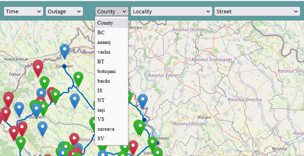

# Overview

Call Radar collects real time call data from emergency contact center and displays the call interactions on map. While call interactions are active, Call Radar gets notifications from OMS about user ticket state and updates the color of the displayed icons. Over the base map, Call Radar also displays the electrical grid, loaded from ArcGIS server.

Call Radar is a web application with client-server architecture. User interface – application client side, is displayed in a standard web browser, all current browser versions being supported. User interface pages are loaded from the server with address https://iot.eonsn.ro/.

Application back-end is running on server and deals with call interactions gathering and storing on database. Interactions from database are live; they have life cycle and state that is updated by an automaton running on server.

Back-end is also responsible for pushing call events, in real time, to user interface from browser. In response to server events, user interface updates call interactions state.
 
# Application Login

Since Call Radar deals with critical data about electrical grid, it uses secure connection with server and requires user authentication.

Application uses a standard user login form and requires credentials defined by external means, in our case the Active Directory server.
 
In current implementation, Call Radar users authenticate themselves with SN credentials.

 
Into login form user should enter only its user name, without any suffix. For example, irotaru but not irotaru@eonsn.ro .

If credentials are not accepted there is no feedback on user login form in order to minimize chances of guessing.

After successful login, application is loaded from server and started. On bad password, login form is displayed again; retries count is limited according Active Directory policy. 

If fail to login multiple times is possible to have account problems and need to contact Active Directory administrator.
 
# User Interface

Current application version has only one page that is opened after successful login. It displays call interactions performed on emergency contact center, pushed by server in real time.

On application start or browser page reload, calls map are loaded from server database, then application is waiting for customers to call emergency contact center. When a call arrives, server back-end is informed by contact center and a call event is pushed to browser.

A call has a life cycle that last for 24 hours. Currently there are four phases; the color of the call interaction icon is changed when call changes its state.

| Color  | Description |
|--------|-------------|
| Green  | Call is less than 2 hours old. |
| Blue	 | Call is between 2 and 14 hours. |
| Red	 | Call is between 14 and 22 hours. |
| Black	 | Call is in its last 2 hours before removing from user interface. |
| Purple | Ticket created on delivery point attached to call. |
| Yellow | Ticket solved; removed from user interface after 2 hours. Call is in its last 2 hours before removing from user interface. |

After call interaction life cycle completes, its icon is removed from call interactions map. Also call interaction is removed from map when OMS declares ticket solved. Once a call interaction removed it can be displayed only using time period selection from main menu.

 
Call interactions page has four components:
- Main Menu on page top,
- Call Interactions Map occupies the central screen area,
- Call Interactions Log on page right side,
- Grid Tree also on the right side, the same area as Call Interactions Log.
It is not possible to display both Call Interactions Log and Grid Tree on the same time. User should select which one is visible, using action icons from Main Menu.

## Main Menu
Main menu from page top has user interface controls for time period selection, filter selectors for call life cycle, outage type, post and electrical address, and icons for calls load, load cancel and user interface clean.

To select the time period user should select the period start and end date and time. There are two standard date selectors in natural order: first start date selector. If user prefers so, there is the option to enter numerical values using indicated format. Time uses 12 hours format, with AM/PM indicator.

On main menu there are also filter selectors used to narrow down the number of call interactions displayed on user interface. To apply filtering user should select filter options from its filter selector.  For details see section 3.5 Filtering.

There are four action icons:
- Start loading call interactions for selected time period,
- Clean up user interface,
- Display current call interactions log,
- Display grid tree.
Depending on the selected time period size, call interactions loading may take some times. While loading is in progress both map and logs are updated on the fly. 

## Call Interactions Map
Call interactions map is based on Open Street Maps and a call interaction is displayed as standard balloon marker. Call marker coordinates are loaded from database based on customer phone number. Over the maps there is also a layer with the electrical grid network, loaded from ArcGIS server.

Map has controls for zoom level.  Zoom level change can be also performed using the mouse wheel. When zoom level is changed the right side views are updated to display only call interactions that are actually visible on map.

## Call Interactions Log
Call interactions log is a simple text log displayed on page right side; a call record is printed in a single line. Log records are displayed top / down with most recent call interaction on top.

Current version displays next pieces of information:
1. Call timestamp is the time call entered emergency contact center,
2. Customer phone number detected by contact center,
3. Postal address composed by county, locality and street.

Postal address is either loaded from database based on customer phone number, or recorded from customer call, if call flow reaches the point where contact center ask for address.

## Grid Tree
Grid Tree displays electrical elements related to current calls. It is standard tree view similar in usage with file explorer from Windows. Grid elements are displayed grouped by: region, substation, medium voltage power line, transformer and low voltage distribution line. There is an icon on each grid element; when click on it grid element is expanded or collapsed. 

 

If want to expand or collapse all grid elements from hierarchy click on desire node while pressing control key. For example, click + ctrl on collapsed region will expand all substations and all other grid elements from hierarchy.

## Filtering
Filters are used to narrow down the number of call interactions displayed on user interface.
To apply filtering user should select filter options from its filter selector. Filters are cumulative; if select multiple filters only calls that satisfy all filters are displayed. 
When filtering is active all views are affected: call interactions map, logs and grid tree. To remove an active filter, select the first option from filter selector.

## Time Filtering
Filter by the age of the call lifecycle. If you use this filter, only calls more recent than the selected time value will be displayed.
 

## Outage Filtering
Filtering after the interruption time is in the works, the integration phase with OMS.
 

## Postal Address Filtering
When the log with call interactions is displayed, there are a number of selectors for the postal address in the main menu, on the components: county, locality and street. The current solution is to display only the names that are present in the calls on the interface.

It is proposed to use a hierarchical selection level: for example, when selecting a county, only the localities in this county should be displayed.
 

## Electrical Address Filtering
On working.

# Map Synchronization
When map zoom level is changed, active right side view is updated to display only call interactions that are actually visible on map.
